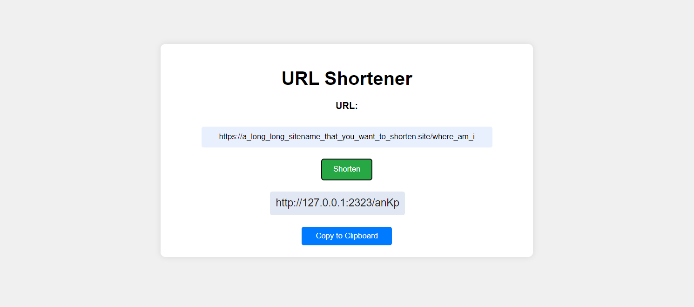
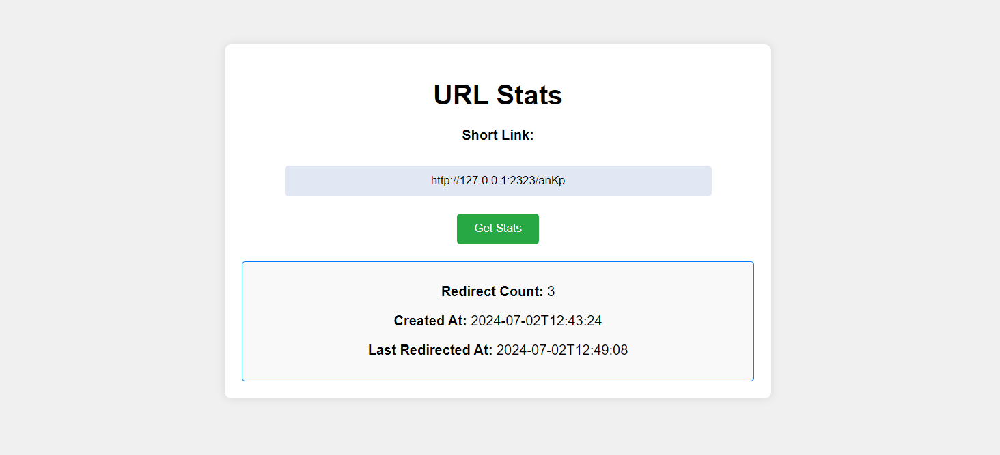

# FASTAPI_URL_SHORTENER

This is a simple shortener for urls with redirection statistics.

How to use:
- start server 
- navigate to the main [ / ] page
- shorten your link anyhow you want
- go to the [ /stats ] page to see statistics

## Showcase



### Installing 

```shell
python -m venv venv
pip install -r requirements.txt
```
---
### Runnning

Linux
```shell
chmod +x ./run.sh
./run.sh
```
---

Windows
```cmd
./run.bat
```
---